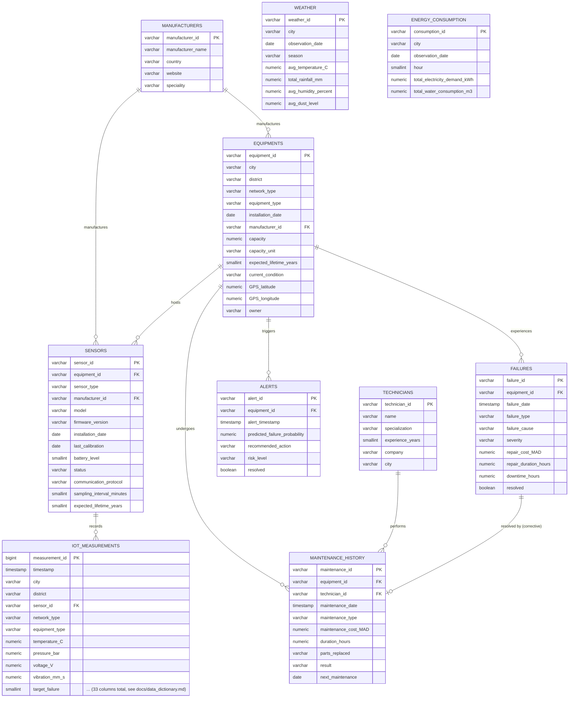

# Entity-Relationship Diagram

## Non-FK joins (documented, not enforced by SQL foreign keys)

- **`weather` ↔ any other table**: join on `(city, DATE(timestamp))` /
  `(city, observation_date)`. Not a formal FK because weather is a daily
  city-level aggregate, not a per-row reference.
- **`energy_consumption` ↔ any other table**: join on
  `(city, DATE(timestamp), hour)`. Same reasoning as weather.
- **`alerts` → `failures`**: not a declared FK (an alert doesn't always lead
  to a failure — many are false alarms), but every alert with `resolved =
  false` corresponds to a genuine pre-failure warning window and its
  `alert_timestamp` is guaranteed to fall strictly before the matching row in
  `failures.failure_date` for the same `equipment_id` (verified at
  generation time — see `docs/relationships.md`).
