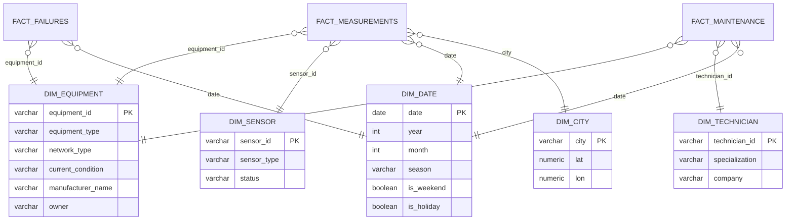

# Data Warehouse Design: Star Schema & Snowflake Schema

## 1. Grain of the warehouse

Two fact tables at two different grains, both anchored to `equipments`:

- **`FACT_MEASUREMENTS`** — one row per IoT reading (10-minute grain) — this
  IS `iot_measurements`, unmodified.
- **`FACT_MAINTENANCE_EVENTS`** — one row per failure OR alert OR maintenance
  operation (event grain) — a union of `failures`, `alerts`, and
  `maintenance_history`, useful for a single "reliability events" Power BI
  visual without three separate visuals.

## 2. Star Schema (recommended for Power BI / self-service analytics)



For a pure star schema, `DIM_EQUIPMENT` denormalizes `manufacturer_name`
directly onto the dimension (flattening the `manufacturers` table into it)
rather than keeping it as a separate linked table — this is the key
difference from the snowflake version below.

## 3. Snowflake Schema (recommended for the PostgreSQL/Oracle OLTP-style layer)

This is what `sql/create_tables.sql` actually implements: `manufacturers` is
kept as its own normalized table, referenced by both `equipments` and
`sensors` (rather than duplicated into each), and `sensors` sits between
`equipments` and `iot_measurements` as its own dimension level:

```
manufacturers
   └─< equipments >─< sensors >─< iot_measurements
              └─< failures
              └─< alerts
              └─< maintenance_history >─ technicians
```

Use the snowflake form for the transactional/relational database (less
redundancy, easier to keep `manufacturers`/`technicians` data consistent when
updated); use the star (flattened) form for the Power BI / analytics layer,
built as views on top of the snowflake tables, e.g.:

```sql
CREATE VIEW dim_equipment AS
SELECT e.*, m.manufacturer_name, m.country AS manufacturer_country
FROM equipments e
JOIN manufacturers m ON e.manufacturer_id = m.manufacturer_id;
```

## 4. ETL / Load Layer Recommendation

1. **Bronze (raw)**: load all 10 CSVs as-is into staging tables — no
   transformation, matches the file schemas exactly.
2. **Silver (conformed)**: apply the `sql/create_tables.sql` constraints,
   enforce FKs, dedupe (`iot_measurements` intentionally retains its ~0.5%
   duplicate rows — see original dataset README — decide per use case whether
   to keep or drop them at this layer).
3. **Gold (star schema / BI)**: materialize `dim_equipment`,
   `dim_sensor`, `dim_date`, `dim_city`, `dim_technician`, and the two fact
   views (`fact_measurements`, `fact_maintenance_events`) as described above.

## 5. Suggested Power BI Model

- Import `equipments`, `sensors`, `manufacturers`, `technicians` as
  **dimension** tables (small, load in full).
- Import `iot_measurements` as the primary **fact** table — given ~200k rows,
  Power BI Import mode handles this comfortably; use DirectQuery only if the
  warehouse grows to millions of rows (e.g. once real SCADA replaces the
  synthetic generator).
- Import `failures`, `alerts`, `maintenance_history` as secondary fact tables
  sharing `dim_equipment` and a common `dim_date`.
- Build **one shared `dim_date`** table (not per-fact date columns) so all
  five fact tables slice consistently by the same season/weekend/holiday
  calendar already present in `iot_measurements`.
- Recommended core visuals:
  - Map visual using `GPS_latitude`/`GPS_longitude` from `equipments`,
    bubble-sized by failure count, colored by `current_condition`.
  - Failure-rate trend over time, sliced by `network_type` / `city` / `season`.
  - Alert → Failure funnel (using `alerts.resolved = false` vs `failures`)
    to show early-warning effectiveness.
  - Maintenance cost & downtime by `equipment_type` and `maintenance_type`.
  - Weather overlay: rainfall vs. water-network failure rate; dust vs.
    electricity-network failure rate.
